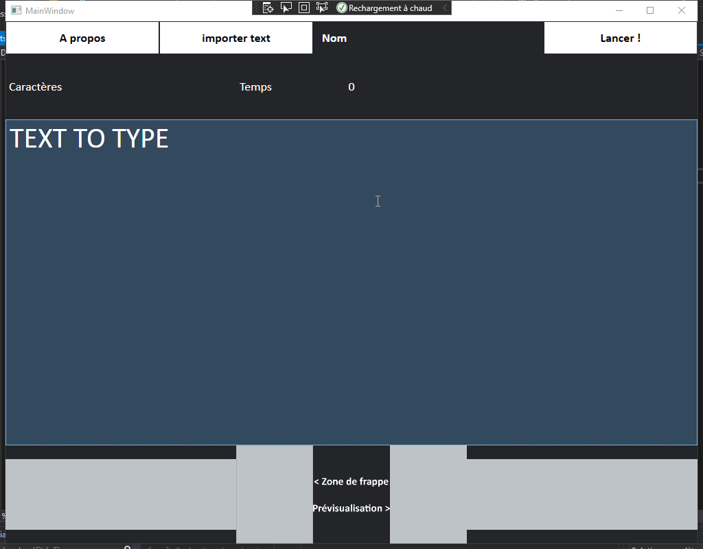

### What about it 
DactyloLibre is usable. However, it is its first time testing version, I'm open for advices, improvement, suggestions. evaluation. etc..

#### Demo
This picture is only a demo, this is not necessary the current code source
   
 
#### Question ?
- [You can post it there](https://github.com/spoutnik911/DactyloLibre-CsharpVersion/labels/question)

#### The next help are welcome
* [Improvement advices](https://github.com/spoutnik911/DactyloLibre-CsharpVersion/labels/enhancement)
* [Bugs repports](https://github.com/spoutnik911/DactyloLibre-CsharpVersion/labels/bug)
* [Creations helps](https://github.com/spoutnik911/DactyloLibre-CsharpVersion/pulls)
  * Media
    * Images (PNG)
      1. Screenshots ?
      2. ... what else ?
    * Colors advises for the user interface
    * Sound (I don't know)
    * [Create, edit the wiki](https://github.com/spoutnik911/DactyloLibre-CsharpVersion/wiki)
  * Code with explanations (for understanding and improving myself)
    * Code implementation suggestions
    * Debug
    * [Translations](https://github.com/spoutnik911/DactyloLibre-CsharpVersion/tree/master/bin_res)
