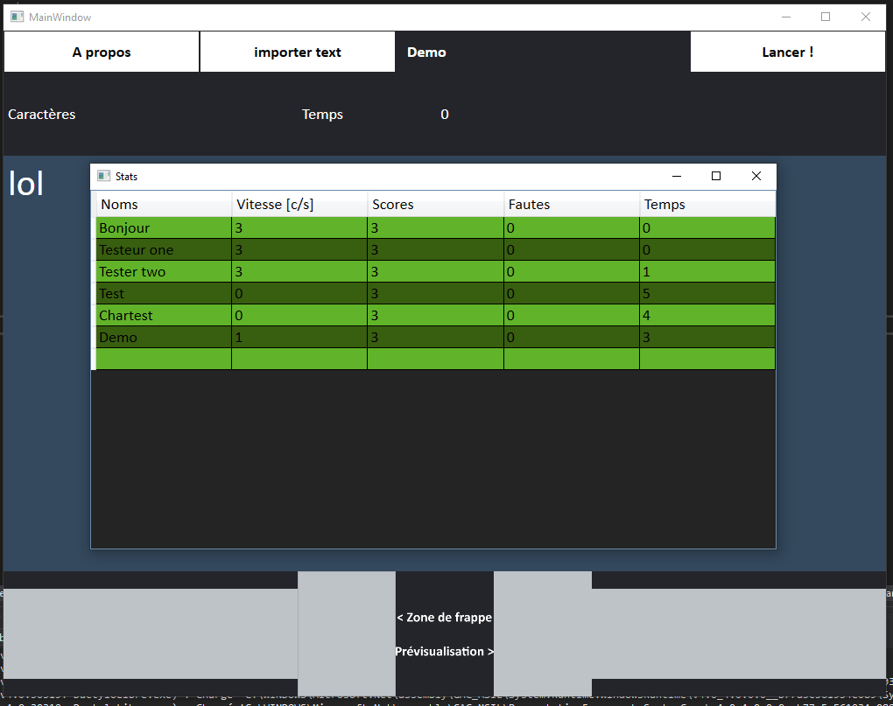

# DactyloLibre-CsharpVersion
Ce petit logiciel vous permetra de vous entrainer à la dactylographie gratuitement. Ce logiciel est une réécriture de l'original [DactyloLibre](https://github.com/spoutnik911/DactyloLibre) en C#

#### Qu'en est il ?
  * [Voir où en est le projet](https://trello.com/b/3WzdA8G9)

#### Si vous avez des questions
- [Vous pouvez les poster ici](https://github.com/spoutnik911/DactyloLibre-CsharpVersion/labels/question)

#### Les aides suivantes sont les bienvenues
* [Conseils d'améliorations](https://github.com/spoutnik911/DactyloLibre-CsharpVersion/labels/enhancement)
* [Signalements de bugs](https://github.com/spoutnik911/DactyloLibre-CsharpVersion/labels/bug)
* [Aide dans la conception](https://github.com/spoutnik911/DactyloLibre-CsharpVersion/pulls)
  * Média
    * Images (PNG)
      1. Logo pour la page du projet
      2. Logo pour l'exécutable
      3. ... à vous de proposer
    * Propositions de couleurs pour l'interface
    * Sons ? (je ne sais pas encore)
    * [Création/Modification du wiki](https://github.com/spoutnik911/DactyloLibre-CsharpVersion/wiki)
  * Code avec éxplications (pour me permettre de comprendre et aussi apprendre)
    * Proposition de code à implémenter
    * Correction de bugs
  * [Traductions](https://github.com/spoutnik911/DactyloLibre-CsharpVersion/tree/master/bin_res)

#### Démonstration
Ces images sont une démonstration et ne sont pas forcément à jour par rapport au code source

